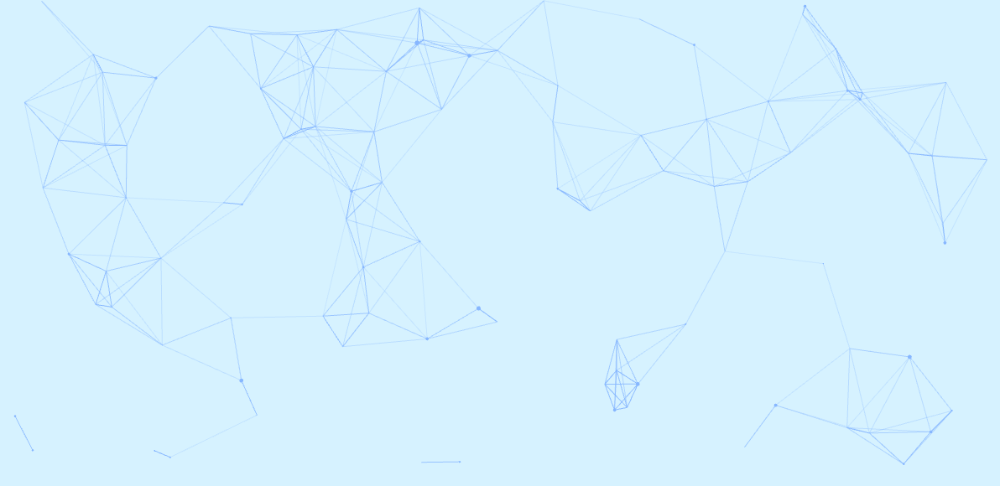

# Hello World! 👋

## I'm Madhavi and I'm passionate about building the websites.

[][particles]

🔭 I’m currently working on building a SPA using Express.js

🌱 I’m currently learning C language...

👯 I’m looking to collaborate on ...

🤔 I’m looking for help with finding a job as a junior developer.

😎 Fun fact: I love music and cooking and sharing with people I love!

🎮 My favourite computer game is Hearthstone and cut the rope.

| Languages  | Web Frameworks |
| ---------- | -------------- |
| Javascript | Express.js     |
| Ruby       | Ruby-on-Rails  |
| SQL        | Angular.js     |
| C          | Next.js        |

[][particles]

[particles]: https://www.linkedin.com/in/madhavi-m-014b79b2/
